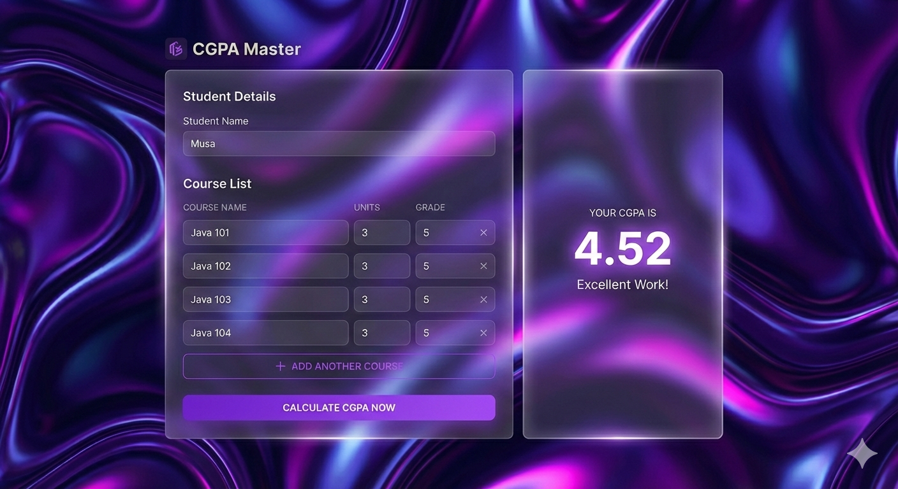
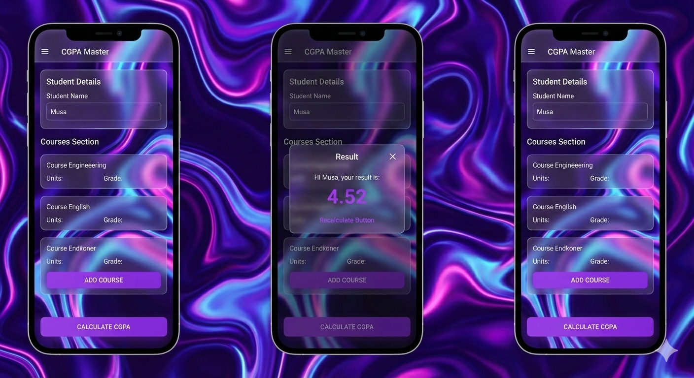

# CGPA Master

CGPA Master is a modern, responsive web application designed to transform the tedious manual process of calculating Grade Point Average (GPA) into a sleek, resilient, and user-friendly digital experience. 

The core vision is simple: **Input Data -> Click a Button -> See the Result.**

It provides students with a persistent workspace that remembers their data and presents their academic standing clearly and beautifully.




---

## ✨ Features

- **Modern, Glassmorphism UI:** A beautiful and intuitive user interface inspired by the "glassmorphism" design trend.
- **Dynamic Course Management:** Easily add or remove courses on the fly.
- **Responsive Design:** A seamless experience whether you're on a desktop or a mobile device.
- **Persistent Workspace:** Your student name and course list are saved in your browser, so your data is waiting for you when you return.
- **Clear Visual Hierarchy:** The final CGPA result is made the most prominent element on the screen, providing an immediate and clear understanding of your academic standing.
- **Instant Feedback:** Receive encouraging messages based on your CGPA result.

---

## 🛠️ Technology Stack

- **Frontend:**
  - **Framework:** React (with Vite)
  - **Language:** JavaScript
  - **Styling:** CSS3 (with support for responsive design)
  - **API Communication:** Axios
- **Backend:**
  - **Framework:** Spring Boot
  - **Language:** Java
  - **Build Tool:** Maven

---

## ⚙️ How It Works

The application consists of a standalone React frontend and a Spring Boot backend that communicate via a REST API.

1.  The user enters their name and course details (name, units, and grade) into the form on the React frontend.
2.  Upon clicking "Calculate CGPA Now", the frontend gathers the data into a JSON object.
3.  An HTTP POST request is sent to the backend's API endpoint.
4.  The Spring Boot backend receives the request, calculates the CGPA using the formula: `Total Grade Points / Total Course Units`.
5.  The backend returns a response containing the student's name and the final calculated CGPA.
6.  The frontend receives this response and displays the result to the user in a visually distinct panel (on desktop) or a pop-up modal (on mobile).

### Backend API Details

The backend exposes a single endpoint for calculating the CGPA.

- **Endpoint:** `POST /api/cgpa/calculate`
- **Hosted URL:** `https://java-school-project.onrender.com/api/cgpa/calculate`

#### Request Body Structure

The endpoint expects a JSON object with the following structure:

```json
{
  "studentName": "Name",
  "courses": [
    {
      "courseName": "Java 101",
      "courseUnit": 3,
      "courseGrade": 5
    },
    {
      "courseName": "React 101",
      "courseUnit": 2,
      "courseGrade": 4
    }
  ]
}
```

#### Response Body Structure

A successful request will return a JSON object with the calculated CGPA:

```json
{
  "studentName": "Musa",
  "cgpa": 4.60
}
```

---

## 🚀 Getting Started

To run this project locally, you will need to run both the backend and frontend servers.

### Backend (`/cgpa` directory)

1.  **Navigate to the backend directory:**
    ```bash
    cd cgpa
    ```
2.  **Run the Spring Boot application using the Maven wrapper:**
    - On macOS/Linux:
      ```bash
      ./mvnw spring-boot:run
      ```
    - On Windows:
      ```bash
      mvnw.cmd spring-boot:run
      ```
    The backend server will start on `http://localhost:8080`.

### Frontend (`/frontend_java_school_project` directory)

1.  **Navigate to the frontend directory:**
    ```bash
    cd frontend_java_school_project
    ```
2.  **Install the necessary dependencies:**
    ```bash
    npm install
    ```
3.  **Start the frontend development server:**
    ```bash
    npm run dev
    ```
    The frontend application will be available at `http://localhost:303`.